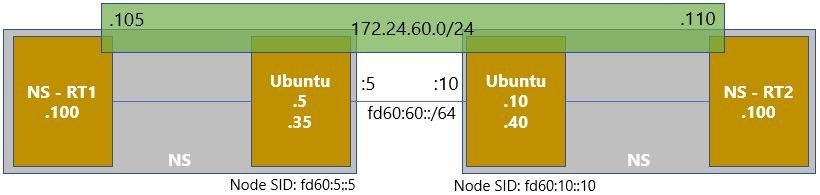

# VPP_SRv6_End.DX2機能検証
End Functionのうち、End.DX2の検証をまとめる。\
End.DX4 はSRv6区間をL2として利用する機能。SRv6区間が一つの大きなスイッチとなる。

[End.DX4](https://github.com/toshi01kudo/VPP_SRv6/tree/main/EndDX4)の説明と重複する箇所は説明しないので、先にEnd.DX4を確認のこと。

## 機器構成


## 設定解説

 - Node SID と End Function設定: ```sr localsid address fd60:5::5 behavior end.dx2 host-RT1```
    - Node SID宛に着信したパケットについて、End Functionに基づいて処理。今回はEnd.DX2なので、出力インターフェースのみ指定。
 - Binding SID と Segment List設定: ```sr policy add bsid fd60:5::999:5 next fd60:10::10 encap```
 - SR-TE設定: ```sr steer l2 host-RT1 via bsid fd60:5::999:5```
    - 指定インターフェースから受信した通信について、Binding SIDで指定したNode SIDへ転送する。

## 検証結果

### 疎通確認

```
// Namespace RT1からPingすると、双方向のカウンターが増加
// Namespace RT1からPing：
root@ubuntu-kudo-01:~# ping 172.24.60.110
PING 172.24.60.110 (172.24.60.110) 56(84) bytes of data.
64 bytes from 172.24.60.110: icmp_seq=1 ttl=64 time=1.92 ms
64 bytes from 172.24.60.110: icmp_seq=2 ttl=64 time=0.592 ms
64 bytes from 172.24.60.110: icmp_seq=3 ttl=64 time=0.614 ms
64 bytes from 172.24.60.110: icmp_seq=4 ttl=64 time=0.598 ms
64 bytes from 172.24.60.110: icmp_seq=5 ttl=64 time=0.568 ms
64 bytes from 172.24.60.110: icmp_seq=6 ttl=64 time=0.593 ms
^C
--- 172.24.60.110 ping statistics ---
6 packets transmitted, 6 received, 0% packet loss, time 5100ms
rtt min/avg/max/mdev = 0.568/0.815/1.928/0.498 ms

// VPP1のカウンター：
root@ubuntu-kudo-01:~# sudo vppctl show sr localsid
SRv6 - My LocalSID Table:
=========================
        Address:        fd60:5::5/128
        Behavior:       DX2 (Endpoint with decapulation and Layer-2 cross-connect)
        Iface:          host-RT1
        Good traffic:   [18 packets : 1372 bytes]
        Bad traffic:    [0 packets : 0 bytes]
--------------------
// VPP2のカウンター：
root@ubuntu-kudo-02:~# sudo vppctl show sr localsid
SRv6 - My LocalSID Table:
=========================
        Address:        fd60:10::10/128
        Behavior:       DX2 (Endpoint with decapulation and Layer-2 cross-connect)
        Iface:          host-RT2
        Good traffic:   [18 packets : 1372 bytes]
        Bad traffic:    [0 packets : 0 bytes]
--------------------


// Namespace RT2からPingすると、双方向のカウンターが増加
// Namespace RT2からPing：
root@ubuntu-kudo-02:~# ping 172.24.60.105
PING 172.24.60.105 (172.24.60.105) 56(84) bytes of data.
64 bytes from 172.24.60.105: icmp_seq=1 ttl=64 time=2.36 ms
64 bytes from 172.24.60.105: icmp_seq=2 ttl=64 time=0.698 ms
64 bytes from 172.24.60.105: icmp_seq=3 ttl=64 time=0.548 ms
64 bytes from 172.24.60.105: icmp_seq=4 ttl=64 time=0.667 ms
64 bytes from 172.24.60.105: icmp_seq=5 ttl=64 time=0.565 ms
^C
--- 172.24.60.105 ping statistics ---
5 packets transmitted, 5 received, 0% packet loss, time 4056ms
rtt min/avg/max/mdev = 0.548/0.968/2.364/0.700 ms

// VPP1のカウンター：
root@ubuntu-kudo-01:~# sudo vppctl show sr localsid
SRv6 - My LocalSID Table:
=========================
        Address:        fd60:5::5/128
        Behavior:       DX2 (Endpoint with decapulation and Layer-2 cross-connect)
        Iface:          host-RT1
        Good traffic:   [25 packets : 1974 bytes]
        Bad traffic:    [0 packets : 0 bytes]
--------------------
// VPP2のカウンター：
root@ubuntu-kudo-02:~# sudo vppctl show sr localsid
SRv6 - My LocalSID Table:
=========================
        Address:        fd60:10::10/128
        Behavior:       DX2 (Endpoint with decapulation and Layer-2 cross-connect)
        Iface:          host-RT2
        Good traffic:   [25 packets : 1974 bytes]
        Bad traffic:    [0 packets : 0 bytes]
--------------------
```


