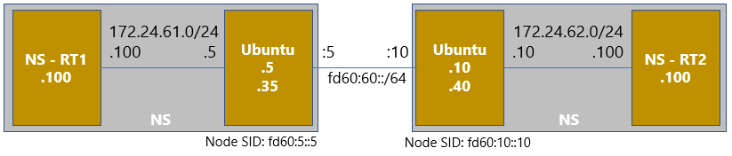

# VPP_SRv6_End.DX4機能検証

## 各ファイル説明
* setup.cfg: VPPのstartup-config。```機器名_setup.cfg``` の形式で保存していますが、```setup.cfg```に名前変更してください。
* create-ns.sh: Network Namespaceを設定するシェルスクリプト。```sudo bash create-ns.sh``` で実行することを想定。```機器名_create-ns.sh``` の形式で保存していますが、```create-ns.sh```に名前変更してください。
* startup.conf: ```/etc/vpp/startup.conf```にデフォルトで保存してあるファイル。下記のstartup-configとインターフェース設定の項目を追加している。
```
unix {
  startup-config /home/ubuntu/setup.cfg
}
dpdk {
  dev 0000:00:04.0
}
```

## 機器構成


## 設定解説

 - Node SID と End Function設定: ```sr localsid address fd60:5::5 behavior end.dx4 host-RT1 172.24.61.100```
    - Node SID宛に着信したパケットについて、End Functionに基づいて処理。今回はEnd.DX4なのでそのまま出力IFと宛先IPを記載。
 - Binding SID と Segment List設定: ```sr policy add bsid fd60:5::999:5 next fd60:10::10 encap```
    - Binding SIDはポリシー名のような扱い。Binding SIDと紐づけられた通信については、Segment Listの順にSRv6区間を通過。
 - SR-TE設定: ```sr steer l3 172.24.62.0/24 via bsid fd60:5::999:5```
    - 指定宛先の通信はBinding SIDのポリシーに基づいて処理。
 - カプセル化送信元アドレス設定: ```set sr encaps source addr fd60:5::5```

## 検証結果

### 疎通確認
* BSIDでポリシーを指定しているためNamespaceからのPingやTraceは可能。Traceは途中のSRv6区間の経路は表示されないらしい。
```
// Namespaceへログイン
ubuntu@ubuntu-kudo-01:~$ sudo ip netns exec RT1 bash

// Namespaceから対向へPing
root@ubuntu-kudo-01:~# ping 172.24.62.100
PING 172.24.62.100 (172.24.62.100) 56(84) bytes of data.
64 bytes from 172.24.62.100: icmp_seq=1 ttl=62 time=5.86 ms
64 bytes from 172.24.62.100: icmp_seq=2 ttl=62 time=0.767 ms
64 bytes from 172.24.62.100: icmp_seq=3 ttl=62 time=0.712 ms
64 bytes from 172.24.62.100: icmp_seq=4 ttl=62 time=0.463 ms
^C
--- 172.24.62.100 ping statistics ---
4 packets transmitted, 4 received, 0% packet loss, time 3050ms
rtt min/avg/max/mdev = 0.463/1.951/5.865/2.262 ms

// Namespaceから対向へTrace (途中経路のIPv4アドレスを設定しないと表示されない)
root@ubuntu-kudo-01:~# traceroute 172.24.62.100
traceroute to 172.24.62.100 (172.24.62.100), 30 hops max, 60 byte packets
 1  * * *
 2  * * *
 3  172.24.62.100 (172.24.62.100)  1.798 ms  1.843 ms  1.891 ms
```

* VPPからのPingは失敗する。BSIDのポリシーに合わないため。
```
ubuntu@ubuntu-kudo-01:~$ sudo vppctl ping 172.24.62.100
Failed: no egress interface
Failed: no egress interface
Failed: no egress interface
Failed: no egress interface
Failed: no egress interface

Statistics: 0 sent, 0 received, 0% packet loss
```

### showコマンド出力確認

#### Node SID(Local SID)によるEnd Functionの設定確認
Node SID宛に着信した場合に、Behavior以降に記載されているFunctionを行う。\
Node SID宛に着信するとカウンターが増加する。GoodとBadのどちらに入るかの定義がわかってないが、Functionが適用できるかどうかではないかと想定。

```
ubuntu-01:
vpp# show sr localsid
SRv6 - My LocalSID Table:
=========================
        Address:        fd60:5::5/128
        Behavior:       DX4 (Endpoint with decapsulation and IPv4 cross-connect)
        Iface:          host-RT1
        Next hop:       172.24.61.100
        Good traffic:   [0 packets : 0 bytes]
        Bad traffic:    [0 packets : 0 bytes]
--------------------

ubuntu-02:
vpp# show sr localsid
SRv6 - My LocalSID Table:
=========================
        Address:        fd60:10::10/128
        Behavior:       DX4 (Endpoint with decapsulation and IPv4 cross-connect)
        Iface:          host-RT2
        Next hop:       172.24.62.100
        Good traffic:   [0 packets : 0 bytes]
        Bad traffic:    [0 packets : 0 bytes]
--------------------
```

#### SR policy設定の確認コマンド
BSIDとSegment listが出力される。

```
ubuntu-01:
vpp# show sr policies
SR policies:
[0].-   BSID: fd60:5::999:5
        Behavior: Encapsulation
        Type: Default
        FIB table: 0
        Segment Lists:
        [0].- < fd60:10::10 > weight: 1
-----------

ubuntu-02:
vpp# show sr policies
SR policies:
[0].-   BSID: fd60:10::999:10
        Behavior: Encapsulation
        Type: Default
        FIB table: 0
        Segment Lists:
        [0].- < fd60:5::5 > weight: 1
-----------
```

#### ルーティングテーブル

- IPv4テーブル
```172.24.62.0/24```宛のルートはStaticを設定していないにも関わらず、ルートとして登録されている。\
```sr steer l3 172.24.62.0/24 via bsid fd60:5::999:5```としてSR-TEの設定を投入することで、出力されるようになる。

```
vpp# show ip fib
ipv4-VRF:0, fib_index:0, flow hash:[src dst sport dport proto ] epoch:0 flags:none locks:[adjacency:1, default-route:1, nat-hi:2, ]
0.0.0.0/0
  unicast-ip4-chain
  [@0]: dpo-load-balance: [proto:ip4 index:1 buckets:1 uRPF:0 to:[0:0]]
    [0] [@0]: dpo-drop ip4
0.0.0.0/32
  unicast-ip4-chain
  [@0]: dpo-load-balance: [proto:ip4 index:2 buckets:1 uRPF:1 to:[0:0]]
    [0] [@0]: dpo-drop ip4
172.24.60.0/32
  unicast-ip4-chain
  [@0]: dpo-load-balance: [proto:ip4 index:15 buckets:1 uRPF:20 to:[0:0]]
    [0] [@0]: dpo-drop ip4
172.24.60.0/24
  unicast-ip4-chain
  [@0]: dpo-load-balance: [proto:ip4 index:14 buckets:1 uRPF:23 to:[0:0]]
    [0] [@4]: ipv4-glean: GigabitEthernet0/4/0: mtu:9000 next:1 fffffffffffffa163e17a6a50806
172.24.60.5/32
  unicast-ip4-chain
  [@0]: dpo-load-balance: [proto:ip4 index:17 buckets:1 uRPF:24 to:[0:0]]
    [0] [@2]: dpo-receive: 172.24.60.5 on GigabitEthernet0/4/0
172.24.60.255/32
  unicast-ip4-chain
  [@0]: dpo-load-balance: [proto:ip4 index:16 buckets:1 uRPF:22 to:[0:0]]
    [0] [@0]: dpo-drop ip4
172.24.61.0/32
  unicast-ip4-chain
  [@0]: dpo-load-balance: [proto:ip4 index:19 buckets:1 uRPF:26 to:[0:0]]
    [0] [@0]: dpo-drop ip4
172.24.61.0/24
  unicast-ip4-chain
  [@0]: dpo-load-balance: [proto:ip4 index:18 buckets:1 uRPF:25 to:[0:0]]
    [0] [@4]: ipv4-glean: host-RT1: mtu:9000 next:2 ffffffffffff02fee719b1910806
172.24.61.5/32
  unicast-ip4-chain
  [@0]: dpo-load-balance: [proto:ip4 index:21 buckets:1 uRPF:30 to:[0:0]]
    [0] [@2]: dpo-receive: 172.24.61.5 on host-RT1
172.24.61.100/32
  unicast-ip4-chain
  [@0]: dpo-load-balance: [proto:ip4 index:33 buckets:1 uRPF:41 to:[0:0]]
    [0] [@5]: ipv4 via 172.24.61.100 host-RT1: mtu:9000 next:3 f6f11b1c1bc502fee719b1910800
172.24.61.255/32
  unicast-ip4-chain
  [@0]: dpo-load-balance: [proto:ip4 index:20 buckets:1 uRPF:28 to:[0:0]]
    [0] [@0]: dpo-drop ip4
172.24.62.0/24
  unicast-ip4-chain
  [@0]: dpo-load-balance: [proto:ip4 index:30 buckets:1 uRPF:38 to:[0:0]]
    [0] [@13]: dpo-load-balance: [proto:ip4 index:29 buckets:1 uRPF:-1 to:[0:0]]
          [0] [@12]: SR: Segment List index:[0]
        Segments:< fd60:10::10 > - Weight: 1
224.0.0.0/4
  unicast-ip4-chain
  [@0]: dpo-load-balance: [proto:ip4 index:4 buckets:1 uRPF:3 to:[0:0]]
    [0] [@0]: dpo-drop ip4
240.0.0.0/4
  unicast-ip4-chain
  [@0]: dpo-load-balance: [proto:ip4 index:3 buckets:1 uRPF:2 to:[0:0]]
    [0] [@0]: dpo-drop ip4
255.255.255.255/32
  unicast-ip4-chain
  [@0]: dpo-load-balance: [proto:ip4 index:5 buckets:1 uRPF:4 to:[0:0]]
    [0] [@0]: dpo-drop ip4
```

- IPv6テーブル
Node SID(```fd60:5::5```)やBinding SID(```fd60:5::999:5```)がルーティングテーブルに載っている。
```
vpp# show ip6 fib
ipv6-VRF:0, fib_index:0, flow hash:[src dst sport dport proto ] epoch:0 flags:none locks:[adjacency:1, default-route:1, ]
::/0
  unicast-ip6-chain
  [@0]: dpo-load-balance: [proto:ip6 index:6 buckets:1 uRPF:5 to:[0:0]]
    [0] [@0]: dpo-drop ip6
fd60:5::5/128
  unicast-ip6-chain
  [@0]: dpo-load-balance: [proto:ip6 index:22 buckets:1 uRPF:29 to:[0:0]]
    [0] [@19]: SR: localsid_index:[0]
fd60:5::999:5/128
  unicast-ip6-chain
  [@0]: dpo-load-balance: [proto:ip6 index:27 buckets:1 uRPF:-1 to:[0:0]]
    [0] [@20]: SR: Segment List index:[0]
        Segments:< fd60:10::10 > - Weight: 1
fd60:10::/64
  unicast-ip6-chain
  [@0]: dpo-load-balance: [proto:ip6 index:31 buckets:1 uRPF:42 to:[0:0]]
    [0] [@5]: ipv6 via fd60:60::10 GigabitEthernet0/4/0: mtu:9000 next:3 fa163ebb8c02fa163e17a6a586dd
fd60:60::/64
  unicast-ip6-chain
  [@0]: dpo-load-balance: [proto:ip6 index:12 buckets:1 uRPF:19 to:[0:0]]
    [0] [@4]: ipv6-glean: GigabitEthernet0/4/0: mtu:9000 next:2 fffffffffffffa163e17a6a586dd
fd60:60::5/128
  unicast-ip6-chain
  [@0]: dpo-load-balance: [proto:ip6 index:13 buckets:1 uRPF:18 to:[1:72]]
    [0] [@2]: dpo-receive: fd60:60::5 on GigabitEthernet0/4/0
fd60:60::10/128
  unicast-ip6-chain
  [@0]: dpo-load-balance: [proto:ip6 index:32 buckets:1 uRPF:40 to:[0:0]]
    [0] [@5]: ipv6 via fd60:60::10 GigabitEthernet0/4/0: mtu:9000 next:3 fa163ebb8c02fa163e17a6a586dd
fe80::/10
  unicast-ip6-chain
  [@0]: dpo-load-balance: [proto:ip6 index:7 buckets:1 uRPF:6 to:[0:0]]
    [0] [@14]: ip6-link-local
SRv6 steering of IP6 prefixes through BSIDs, fib_index:2, flow hash:[src dst sport dport proto ] epoch:0 flags:none locks:[SR:1, ]
::/0
  unicast-ip6-chain
  [@0]: dpo-load-balance: [proto:ip6 index:23 buckets:1 uRPF:31 to:[0:0]]
    [0] [@0]: dpo-drop ip6
fd60:5::999:5/128
  unicast-ip6-chain
  [@0]: dpo-load-balance: [proto:ip6 index:28 buckets:1 uRPF:-1 to:[0:0]]
    [0] [@21]: SR: Segment List index:[0]
        Segments:< fd60:10::10 > - Weight: 1
fe80::/10
  unicast-ip6-chain
  [@0]: dpo-load-balance: [proto:ip6 index:24 buckets:1 uRPF:32 to:[0:0]]
    [0] [@14]: ip6-link-local
SRv6 steering of IP4 prefixes through BSIDs, fib_index:3, flow hash:[src dst sport dport proto ] epoch:0 flags:none locks:[SR:1, recursive-resolution:1, ]
::/0
  unicast-ip6-chain
  [@0]: dpo-load-balance: [proto:ip6 index:25 buckets:1 uRPF:33 to:[0:0]]
    [0] [@0]: dpo-drop ip6
fd60:5::999:5/128
  unicast-ip6-chain
  [@0]: dpo-load-balance: [proto:ip4 index:29 buckets:1 uRPF:-1 to:[0:0]]
    [0] [@12]: SR: Segment List index:[0]
        Segments:< fd60:10::10 > - Weight: 1
fe80::/10
  unicast-ip6-chain
  [@0]: dpo-load-balance: [proto:ip6 index:26 buckets:1 uRPF:34 to:[0:0]]
    [0] [@14]: ip6-link-local
```
