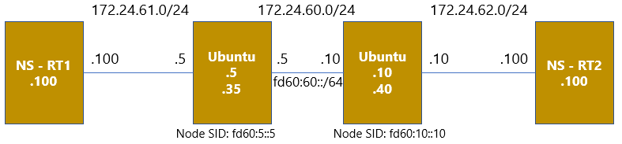

# VPP_SRv6

UbuntuへVPPをインストールし、SRv6環境を構築する際のConfig等を保管するリポジトリ。

## リポジトリの構成
このrootディレクトリではインストール方法や検証構成の作り方を解説し、配下のディレクトリで検証用のConfig等を保管し、結果を説明する。

## 使用機器
* Ubuntu 18.4 LTS x 2台

## 検証構成
Network Namespaceを利用し、仮想的に4台構成として検証を行う。\
ホストOSのみVPP上でSRv6を動作させ、両端の機器はPC相当として動作させるので、Namespaceの機能のみで十分。



## 検証内容
* End.DX4
* End.DT4


## VPPのインストール方法
参考URL: [Installing_VPP_binaries_from_packages - FD.io](https://wiki.fd.io/view/VPP/Installing_VPP_binaries_from_packages#Ubuntu.2FDebian)

```
curl -s https://packagecloud.io/install/repositories/fdio/release/script.deb.sh | sudo bash
sudo apt-get update
sudo apt-get install vpp vpp-plugin-dpdk vpp-plugin-core
```

## VPPの仕組みと初期設定

### VPPはサービスとして動作
下記コマンドでvpp.serviceの状態がわかる。
```
sudo service vpp status
```
初期設定などを変更した場合には、下記でVPPを再起動する必要あり。
```
sudo service vpp restart
```

### VPPを操作
* VPPの操作画面への移動方法: ```sudo vppctl``` 
* Linuxのbashから直接操作: ```sudo vppctl <command>``` 
  * 例: 
    * ```sudo vppctl show version```: VPPのバージョンを確認
    * ```sudo vppctl show interface```: VPPのinterfaceを確認

### VPP上へのinterface生成方法
* ```sudo lshw -class network -businfo``` にて追加予定のPCIの```@```以降を確認。
  * 追加予定のinterfaceはリンクダウンしている必要があるので```ip link```で確認し、UPだったらDownさせる。（Interfaceの設定を削除し、再起動が必要な場合あり）
* ```/etc/vpp/startup.conf``` (VPPの初期設定ファイル) の ```dpdk``` 配下に先ほどのPCIの値を追加。
* VPPサービスを再起動すると、interfaceが追加される。
```
ubuntu@ubuntu-kudo-01:~$ sudo lshw -class network -businfo
Bus info          Device     Class      Description
===================================================
pci@0000:00:03.0             network    Virtio network device
virtio@0          ens3       network    Ethernet interface
pci@0000:00:04.0             network    Virtio network device

ubuntu@ubuntu-kudo-01:~$ sudo vi /etc/vpp/startup.conf
...
dpdk {
	dev 0000:00:04.0
}
...
ubuntu@ubuntu-kudo-01:~$ sudo service vpp restart
ubuntu@ubuntu-kudo-01:~$ sudo vppctl show interface
              Name               Idx    State  MTU (L3/IP4/IP6/MPLS)     Counter          Count
GigabitEthernet0/4/0              1     down         9000/0/0/0
local0                            0     down          0/0/0/0
```

### VPP の Startup-configの作成
VPPの初期設定ファイル ```/etc/vpp/startup.conf``` にStartup-configを読み込むようにすることが可能。\
※下記の```userid```は自身のディレクトリに適宜変更すること。ちなみにファイルを置く場所はどこでもよいので、適宜パス自体も変更のこと。
```
unix {
	...
	startup-config /home/userid/setup.cfg
	...
}
```

記載方法は```vppctl```の状態で入力するコマンドをそのまま記載するだけ。コメントアウトの方法がわかってないので、要確認。


## VPPとNetwork Namespaceの結合方法
参考URL: [Configure_VPP_As_A_Router_Between_Namespaces - FD.io](https://wiki.fd.io/view/VPP/Configure_VPP_As_A_Router_Between_Namespaces)

